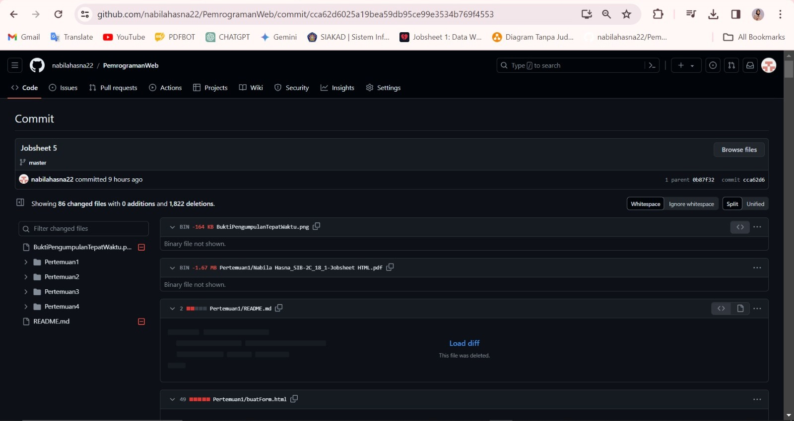

Assalamualaikum, Pak Dimas.

Mohon maaf atas keterlambatan upload Pertemuan 1, 2, dan 3, dan 4 pada github, dikarenakan saat saya push pertemuan 5 ke github terdapat eror pada repository PemrogramanWeb sehingga folder tidak bisa dipush, kemudian saat saya sudah bisa menambahkan folder ke reporitory folder-folder lainnya malah terhapus saat saya melakukan commit untuk folder Pertemuan5 dan muncul seperti ini:

C:\laragon\www\dasarWeb\Pertemuan5>git add .
C:\laragon\www\dasarWeb\Pertemuan5>git commit -m "Jobsheet 5"
[master cca62d6] Jobsheet 5
 86 files changed, 1822 deletions(-)
 delete mode 100644 BuktiPengumpulanTepatWaktu.png
 delete mode 100644 Pertemuan1/Nabila Hasna_SIB-2C_18_1-Jobsheet HTML.pdf
 delete mode 100644 Pertemuan1/README.md
 delete mode 100644 Pertemuan1/buatForm.html
 delete mode 100644 Pertemuan1/buatTabel.html
 delete mode 100644 Pertemuan1/font.html
 delete mode 100644 Pertemuan1/gambar.html
 delete mode 100644 Pertemuan1/gambar1.png
 delete mode 100644 Pertemuan1/gambar2.png
 delete mode 100644 Pertemuan1/garisHorizontal.html
 delete mode 100644 Pertemuan1/heading.html
 delete mode 100644 Pertemuan1/headingAlign.html

Sehingga saya harus melakukan push ulang untuk folder pertemuan 1 sampai 4.

BUKTI FOLDER TERHAPUS

BUKTI PENGUMPULAN

