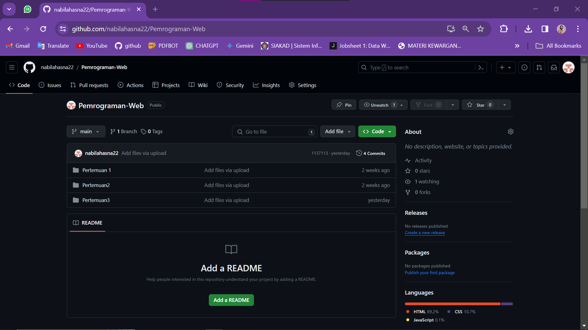

Assalamualaikum, Pak Dimas.
Saya Nabila Hasna Rafifah Hardani, Kelas SIB-2C, nomor presensi 17.

Mohon maaf atas keterlambatan upload Pertemuan 1 sampai 5 pada github, dikarenakan pada tanggal 20 Februari 2024 saat saya mengalami eror saat ingin push file pertemuan 1 sampai 3 melalui command prompt pada repository yang lama https://github.com/nabilahasna22/Pemrograman-Web. Pada repository tersebut awalnya saya megupload file dengan drag and drop, saat hendak melakukan push melalui command prompt terdapat beberapa eror, sehingga saya membuat repository ini sebagai repository baru saya di mata kuliah pemrograman web.

Setelah itu, saya kembali mengalami beberapa eror pada tanggal 25 Maret 2024 pada saat saya mencoba mengupload folder pertemuan 5 melalui command prompt yang menyebabkan semua folder yang sudah saya upload pada repository PemrogramanWeb ini hilang semua alias terhapus. Sehingga saya harus push ulang folder pertemuan 1 sampai dengan 5. Akan tetapi setelah beberapa kali eror dan saya mencoba untuk push kembali, ada eror saat saya hendak push file pertemuan 4 , sehingga saya melakukan upload manual untuk folder pertemuan 4 yaitu dengan drag and drop file.

BUKTI PENGUMPULAN PERTEMUAN 1 SAMPAI 3 DI REPOSITORY LAMA

BUKTI PENGUMPULAN PERBAIKAN 1 SAMPAI 4 

BUKTI EROR

